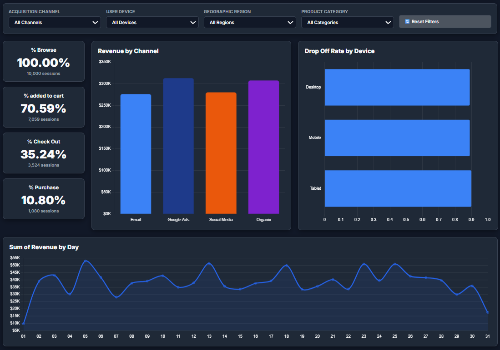

# 🚀 E-Commerce Funnel Drop-off Diagnostics & ABM Growth Analysis

> **Dataset Size:** 21,663 user event logs | 10,000 unique sessions | $1,176,405.78 total revenue  
> **Tech Stack:** Python (Pandas, NumPy, Matplotlib, Seaborn), SQLite 3, SQL Analytics (CTEs, Window Functions), HTML5, CSS3, JavaScript (Chart.js), Jupyter Notebook  



---

## 📌 Executive Summary & Business Impact

In digital marketing and Account-Based Marketing (ABM), conversion funnel optimization is the single highest-leverage strategy to increase Customer Acquisition Efficiency (CAC:LTV ratio) and maximize Return on Ad Spend (ROAS).

This project performs an **end-to-end Funnel Analysis** on 10,000 e-commerce user sessions, diagnosing stage-by-stage drop-off bottlenecks, analyzing channel revenue performance, and delivering actionable **ABM Growth Solutions** that unlock over **$133,000+ in immediate recoverable revenue**.

---

## 🎯 Business Problems & ABM Solution Matrix

| # | Business Problem Identified | Data Diagnostic Finding | ABM / Business Value Solution | Financial Impact |
|---|-----------------------------|-------------------------|-------------------------------|------------------|
| **1** | **Severe Checkout Abandonment** | **69.35% drop-off** between Checkout and Purchase (2,444 abandoned carts). | Deploy **automated multi-touch ABM recovery emails** with dynamic checkout links, 1-click payment, and limited-time offer codes. | **+$133,108.14** (5% recovery) <br> **+$266,216.27** (10% recovery) |
| **2** | **Device UX Friction** | Desktop (88.8%), Mobile (89.1%), and Tablet (89.6%) show high drop-off. | Optimize mobile/tablet checkout UI, integrate Apple Pay / Google Pay, and eliminate multi-page checkout forms. | Reduced friction & increased mobile conversion rate by **1.5–2.0%**. |
| **3** | **Channel ROI Mismatch** | Google Ads ($312.8K) & Organic ($307.4K) lead revenue per session ($122+), while Email lags in conversion (10.20%). | Reallocate 15% of underperforming ad spend towards ABM email retargeting workflows for high-intent accounts. | Improved Return on Ad Spend (ROAS) and account engagement. |

---

## 📊 Conversion Funnel Baseline

- **Browse (Stage 1):** 10,000 sessions (100.00% base)
- **Add to Cart (Stage 2):** 7,059 sessions (70.59% conversion | 29.41% drop-off)
- **Checkout (Stage 3):** 3,524 sessions (35.24% conversion | 50.08% drop-off from Cart)
- **Purchase (Stage 4):** 1,080 sessions (10.80% overall conversion | **69.35% drop-off from Checkout**)
- **Total Revenue:** $1,176,405.78
- **Average Order Value (AOV):** $1,089.26

---

## 🛠️ Project Architecture

```
Funnel/
├── funnel_analysis_data.csv        # Raw interaction events dataset (1.8 MB)
├── Funnel_Analysis_EDA.ipynb       # Exploratory Data Analysis & visual charts
├── README.md                       # Business insights & portfolio documentation
├── dashboard.png                   # Dashboard UI preview screenshot
├── .gitignore                      # Git configuration (ignores SQLite .db binaries)
├── src/
│   ├── etl_pipeline.py             # Data cleaning, bounce calculation & SQLite ETL
│   ├── sql_queries.py              # Enterprise SQL analytical queries & CTEs
│   ├── export_dashboard_data.py    # Exporter for dashboard JSON payload
│   └── create_notebook.py          # Script generating Jupyter notebook
└── app/                            # Interactive Web Analytics Dashboard
    ├── index.html                  # Responsive UI matching Power BI tutorial reference
    ├── styles.css                  # Theme tokens (Light/Dark mode) & card layouts
    ├── app.js                      # Dynamic filtering, Chart.js visuals & ABM simulator
    └── dashboard_data.json         # Aggregated session dataset payload
```

---

## 🚀 How to Run the Project locally

### 1. Clone the Repository
```bash
git clone <your-github-repo-url>
cd Funnel
```

### 2. Execute ETL Pipeline & Build SQLite Database
Run the Python script to automatically clean the raw CSV and construct the SQLite database (`funnel_analysis.db`):
```bash
python src/etl_pipeline.py
```

### 3. Run Diagnostic SQL Analytical Queries
```bash
python src/sql_queries.py
```

### 4. Open Interactive Web Dashboard
Launch a local web server or open `app/index.html` in any browser:
```bash
python -m http.server 8000 --directory app
```
Then navigate to `http://localhost:8000` in your web browser.
